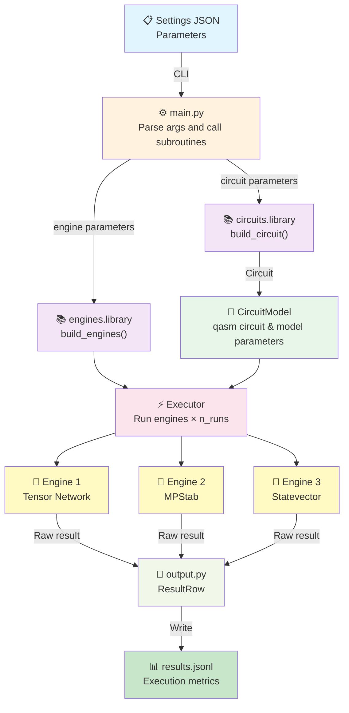

# mssim — Multi System Simulator

A quantum circuit classical simulation package supporting multiple simulation engines. Designed for comparative analysis of different simulation backends.

## Installation

After the project has been downloaded the [mpstab](https://github.com/mattia-robbiano/mssim) library must be installed into the project folder first. Then the rest of the installation can be done by running following command in the project root:

```bash
pip install -e .
```

> [!NOTE]
> This package only supports 3.12.* versions of Python.


## Project Structure

```
mssim/
├── main.py                          # Entry point: config parsing and orchestration
├── src/mssim/
│   ├── __init__.py
│   ├── executor.py                  # Executor: orchestrates engine runs
│   ├── output.py                    # Result row serialization (JSONL/HDF5)
│   ├── circuits/
│   │   ├── __init__.py
│   │   ├── model.py                 # CircuitModel dataclass
│   │   └── library.py               # Circuit builders (ising, kicked-ising, hardware_efficient, etc.)
│   └── engines/
│       ├── __init__.py
│       ├── abstract.py              # BenchmarkEngine base class
│       ├── mpstab.py                # MPStab / HSMPO backend
│       ├── quimb.py                 # Quimb tensor network backend
│       ├── qiskit.py                # Qiskit statevector backend
│       └── library.py               # Engine factory & registry
├── script/
│   ├── run_simple.sh                # Single-machine launcher
│   └── run_parallel.sh              # SLURM array job launcher
├── plots/
│   ├── main_plotting.py              # Plotting CLI entrypoint
│   ├── run_plotting.sh               # Bash wrapper for plotting
│   └── plot_settings.json            # Plot configuration
├── tests/
│   └── test_basic.py
├── results/                         # Output directory
├── settings.json                    # Configuration file
├── pyproject.toml                   # Package metadata
└── README.md
```

## System Architecture



## Supported Engines

| Engine | Backend | Type |
|--------|---------|----------|
| `"quimb"` | Quimb | Tensor network|
| `"mpstab"` | MPStab | Hybrid Stabilizer-Tensor Network|
| `"qiskit"` | Qiskit | Statevector|

## Usage

### Command Line

```bash
# Install in editable mode
pip install -e .

./scripts/run_simple.sh <settings.json>

# Generate plots from the plotting settings file
bash plots/run_plotting.sh
```

## Plotting Layout

Reusable plotting code lives under [src/mssim/plots/](src/mssim/plots/) and is split into:

- `general.py` for data loading and other observable-agnostic helpers
- `utilities.py` for shared plotting utilities
- `magnetization.py` (and other obervables) observable-specific plotting pipeline

The launcher in [plots/main_plotting.py](plots/main_plotting.py) reads [plots/plot_settings.json](plots/plot_settings.json) and saves the output image to the filename specified in `output.filename`. Relative output names are resolved inside the top-level [plots/](plots/) folder.
When `hue_param` is used, `exclude_hue_value` can be set in [plots/plot_settings.json](plots/plot_settings.json) as a single value or list to omit one or more hue buckets from the plot.

### Settings JSON Format

```json
{
  "model": {
    "circuit": "kicked-ising",
    "n_qubits": 8,
    "depth": 4,
    "observable": ["ZZXZXXYY"],
    "kwargs": {}
  },
  "execution": {
    "engines": ["quimb", "qiskit"],
    "n_runs": 10,
    "max_bond_dimension": 32
  },
  "output": {
    "filename": "results/output.jsonl",
    "format": "jsonl",
    "verbose": False
  }
}
```

### Configuration Options

| Field | Type | Description | Example |
|-------|------|-------------|---------|
| `model.circuit` | str | Circuit family name | `"random_clifford"` |
| `model.n_qubits` | int | Number of qubits | `8` |
| `model.depth` | int | Circuit depth | `4` |
| `model.observable` | list[str] | Measurement observable | `["Z", "I", "Z"]` |
| `model.kwargs` | dict | Circuit-specific parameters | `{}` |
| `execution.engines` | list[str] | Engines to run | `["tn", "sv"]` |
| `execution.n_runs` | int | Repetitions per engine | `10` |
| `execution.max_bond_dimension` | int\|null | MPS bond cap | `32` |
| `output.filename` | str | Output file path | `"results/output.jsonl"` |
| `output.format` | str | Output format | `"jsonl"` or `"hdf5"` |
| `output.verbose` | bool | Verbosity | `true` or `false` |


## SLURM Integration

```bash
# Submit array job
sbatch script/run_parallel.sh <settings.json>

# Job runs with parameters varied across array tasks
```

The launcher automatically embeds SLURM metadata (job ID, array task ID, hostname) in result files for traceability (work in progress).
